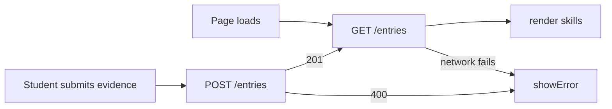

# Entries: Data Leaves the Browser

# Skill Evidence Log

[HW3 repository](https://github.com/ReginaChoi/mgt3745-hw3)

## What
An accounting student picks a career path (audit, forensic accounting, or government/IRS), sees the skills that path requires, and attaches evidence from coursework or an internship to a skill to mark it evidenced. Built from a 2025 accounting graduate's interview (INT-03), who had no way to track which skills she needed or show evidence of having built them. Full spec in [PROJECT.md](context/PROJECT.md) and [FEATURES.md](context/FEATURES.md).

As of HW4, evidence is stored in a Cloudflare Worker and D1 database instead of browser localStorage, so it survives a cleared cache and follows the student across devices — see [ADR-002](context/ARCHITECTURE.md).

## See It Work
A screenshot/GIF in `/docs` showing evidence surviving a cleared cache.

## How to Run
Deployed: `https://mgt3745-hw4.rchoi47.workers.dev/entries`

From a fresh Codespace:
1. Open the repository in a Codespace. The devcontainer installs xdg-utils and runs `npm install`.
2. `npx wrangler login --device`, then follow [docs/SESSION_B_COMMANDS.md](docs/SESSION_B_COMMANDS.md) to create the database, run the schema, and deploy.
3. Confirm the deployed URL in `app.js` as `API` (already set to `https://mgt3745-hw4.rchoi47.workers.dev`).
4. Right-click `index.html`, choose **Open with Live Server**.

To run the Worker locally instead: `npm run dev` (port 8787, local D1 emulator).

## Status
| Feature | EARS statement | Verdict |
|---|---|---|
| Display skills for a path | WHEN a student selects a career path, THE SYSTEM SHALL display its skills within 2 seconds | PASS |
| Attach evidence | WHEN a student attaches evidence to a skill, THE SYSTEM SHALL update its status to "evidenced" | PASS |
| Reject invalid submission | IF evidence is submitted with no skill selected or empty text, THEN THE SYSTEM SHALL show an error and preserve entered text | PASS |
| Survive cleared cache | THE SYSTEM SHALL return stored evidence after a cleared cache | PASS |
| Server unreachable | IF the server is unreachable, THE SYSTEM SHALL tell the student on the page | PASS |
| Server returns 500 | — | CANNOT TEST YET |
| Second student, same table | — | DEFERRED (ADR-002) |

Full verification table in [FEATURES.md](context/FEATURES.md).

## Links
Reading order: [PROJECT.md](context/PROJECT.md) → [USERS.md](context/USERS.md) → [FEATURES.md](context/FEATURES.md) → [ARCHITECTURE.md](context/ARCHITECTURE.md) → [STANDARDS.md](context/STANDARDS.md) → [TOOLS.md](context/TOOLS.md) → [STYLE.md](context/STYLE.md) → [CLAUDE.md](context/CLAUDE.md)

## AI Use
Copilot wrote the first draft of the `fetch` wrapper in `app.js` (the `load`/`save` functions) and the initial `worker.js` GET/POST handlers. I checked the CORS preflight branch by intentionally removing it, watching the browser block the request, and putting it back — that's the part of the Worker I could not fully verify just by reading it, since CORS behavior only shows up at request time, not in the code itself. Copilot's first suggestion for the INSERT statement concatenated `body.evidenceText` directly into the SQL string; I caught it against STANDARDS.md rule 7 and rewrote it with `bind()` (see FAILURES.md).

Hours spent: 12.*