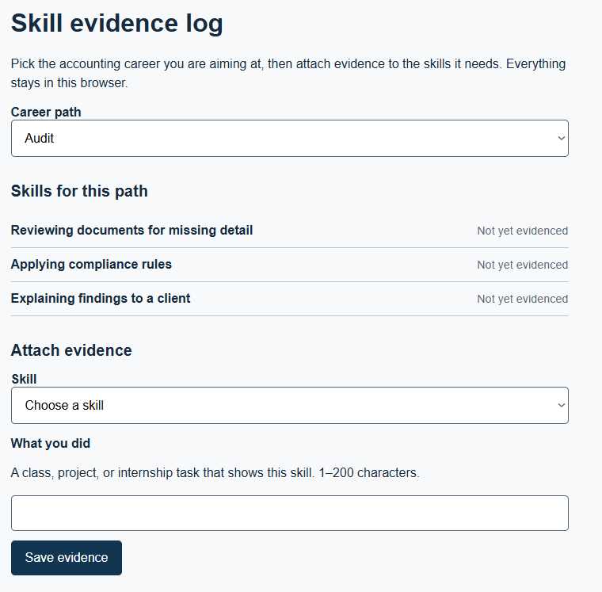
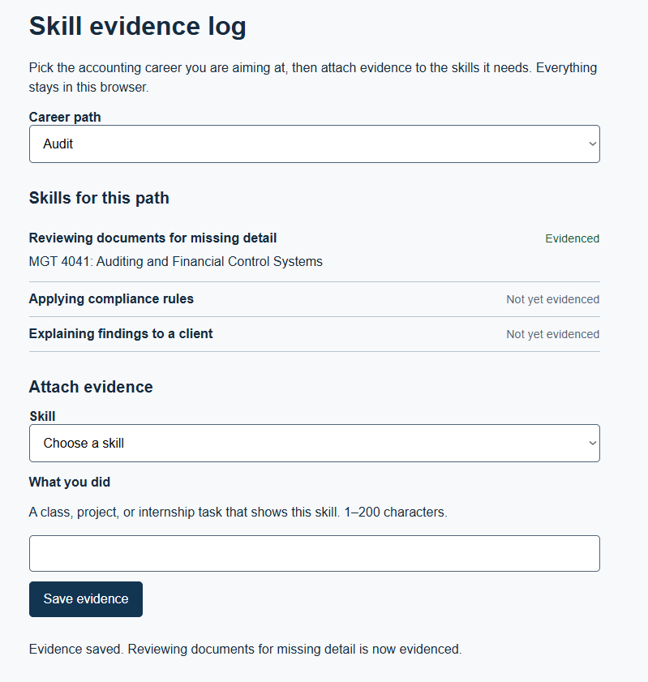
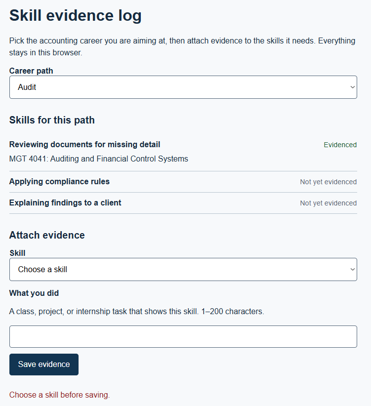
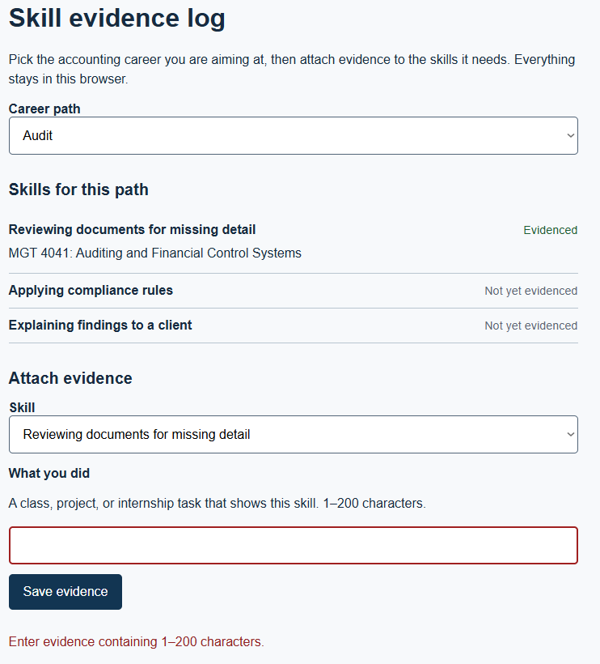
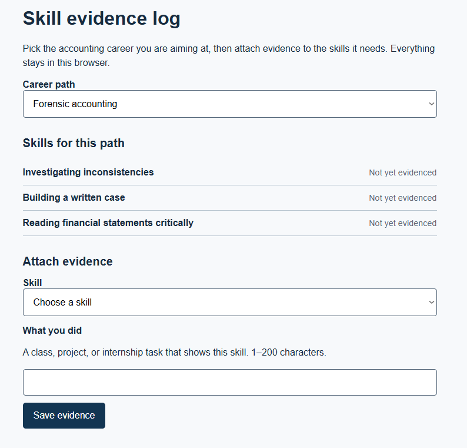
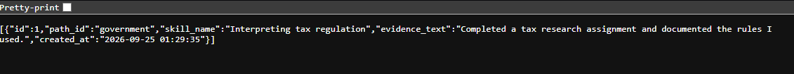
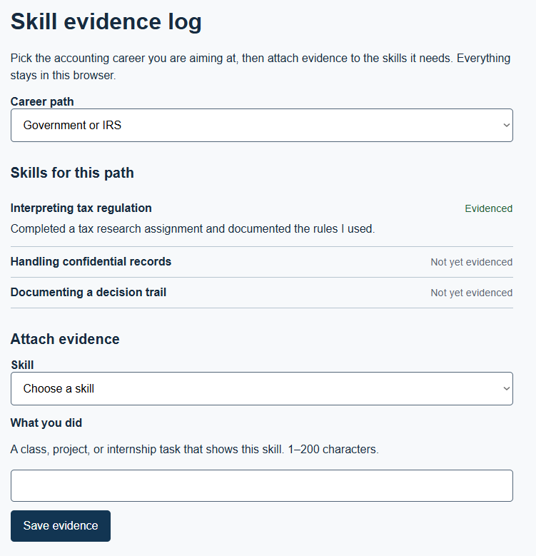

# Features and specification

Status: ACTIVE.

## Context
The situation, job, and desired progress: An accounting student wants a long-term career in a field like audit, forensic accounting, or a government role such as the IRS, but has no reliable way to tell which skills that path actually requires or to show evidence of having built them. INT-03, a 2025 accounting graduate, confirmed the first half directly: she never figured out which skills to develop, graduated with no internship, and is currently unemployed. She also contradicted the AI premise this project started from in HW1: asked whether AI changed how she prepared or how she viewed accounting jobs, she said no. The AI-anxiety framing is therefore carried as an open hypothesis, not a finding.

## Users
Profiles and evidence in USERS.md. PROFILE-01 (accounting student or recent graduate) is the target user and is now evidenced directly by INT-03, an accounting graduate, rather than assumed. PROFILE-02 (Inventory Specialist, INT-02) remains as indirect evidence for tracking behavior, though INT-03 challenges how far that behavior transfers to students.

## Scope and non-goals
Included behavior: an accounting student picks a career path, sees the skills that path requires, attaches evidence from coursework or internships to a skill, and sees that skill's status change from not yet evidenced to evidenced.

Non-goals: does not predict which jobs AI will eliminate, guarantee employment, find or create internships, claim any skill stays valuable long-term, choose a career path for the student, replace a degree or advisor, or compare students against each other.

**Full product scope vs. build implementation.** FEATURES.md describes six candidate features (F-01 through F-06). Only F-03, the evidence log, is implemented, first as three static HW3 files with browser storage, now as a Cloudflare Worker and D1 backing the same page (see ADR-002 in ARCHITECTURE.md). F-01, F-02, F-04, F-05, and F-06 remain specified below but unbuilt. Within F-03 itself, Behavior steps 1 through 5 are implemented and steps 6 and 7 are deferred.

### Kano hypotheses

| Feature ID | Feature | Kano hypothesis | Segment / date | Evidence and reasoning |
|---|---|---|---|---|
| F-01 | Skill list tied to a chosen career path | Must-be (revised, was Performance) | Accounting students / 9/17/2026 | Upgraded on direct evidence: INT-03 never identified the skills her target career needed, and named seeing relevant skills as the part of this tool she would find most useful. |
| F-02 | Progress tracker across skills | Performance (revised, was Must-be) | Accounting students / 9/17/2026 | Downgraded on direct evidence: INT-03 never tracked skills and said she never thought to. The Must-be label came from INT-02, who is not in this segment. Useful, not load-bearing. |
| F-03 | Evidence log linking coursework or internships to a skill | Attractive | Accounting students / 9/17/2026 | INT-03 had no way to connect coursework to anything she could show an employer, and did not ask for one. Unrequested but addresses a gap she named in hindsight. **Selected for build.** |
| F-04 | Automated reminders to revisit stale skills | Indifferent | Accounting students / 9/10/2026 | Not requested by any participant. Labeling honestly rather than as Attractive. |
| F-05 | Peer comparison of skill progress | Reverse | Accounting students / 9/10/2026 | Unchanged, but the reasoning has weakened: it rested on students being anxious about AI, and INT-03 reported no such anxiety. Held as Reverse on the separate ground that comparison against peers who have internships would discourage a student who has none. |
| F-06 | Exportable skill summary (resume or portfolio format) | Attractive | Accounting students / 9/17/2026 | INT-03's stated reason for wanting the tool at all was "hopefully I'd get a job," which points at output an employer can see rather than at tracking for its own sake. |

## Behavior
Sequence, conditions, actions, and visible outcomes for F-03. Steps 1 through 5 are implemented; steps 6 and 7 are deferred (see ADR-001, unchanged by ADR-002).

1. The page loads and reads any previously saved evidence, now from the deployed Worker instead of browser storage.
2. The student selects a career path from the available paths.
3. The system displays the skills associated with that path, each marked not yet evidenced or evidenced.
4. The student selects a skill and enters a short description of evidence from coursework, a project, or an internship.
5. The system sends the evidence to the Worker, marks that skill evidenced once the server confirms it, and redraws the list. If the save fails, the entered text is preserved and an error is shown.
6. The student marks a skill in progress as an intermediate state between not yet evidenced and evidenced. (Deferred.)
7. The student exports a summary of evidenced skills. (Deferred.)

## Constraints
Platform, data, privacy, scope, and relevant limits: this is a tracking system, not a forecaster of which jobs AI will automate. It must distinguish a skill with attached evidence from one the student merely claims. Skill data is no longer private to one browser by default now that it lives on a server; see TOOLS.md for what that server is trusted with. No peer comparison without opt-in. The path and skill lists must be editable, since what counts as relevant will change. The system must not present itself as a substitute for coursework, internships, or an advisor. Student-entered text must be rendered as text, never as markup, on the way in and on the way out.

## Acceptance
- AC-1, event-driven: WHEN a student selects a career path, THE SYSTEM SHALL display its skills within 2 seconds.
- AC-2, event-driven: WHEN a student attaches evidence to a skill, THE SYSTEM SHALL update its status to "evidenced."
- AC-3, unwanted: IF a student submits evidence with no skill selected or with empty text, THEN THE SYSTEM SHALL show an error and preserve the entered text.
- AC-4, unwanted: IF the save fails, THEN THE SYSTEM SHALL keep the entered text on screen and name the reason.
- AC-5, state-driven: WHILE a skill has no attached evidence, THE SYSTEM SHALL display it as "not yet evidenced."
- AC-6, state-driven: WHILE peer comparison is disabled, THE SYSTEM SHALL NOT display any other student's data.
- AC-7, optional: WHERE a career path is inactive, THE SYSTEM SHALL still preserve evidence logged under it. **Not implemented** (see Scope); no UI exists to mark a path inactive. Classified separately below.
- AC-8, unwanted (added HW4): IF the evidence text submitted to the server is missing or longer than 200 characters, THEN THE SYSTEM SHALL reject the request with a 400 status and a message naming the problem. This is the validation rule worker.js adds beyond the checks app.js already runs on the client, since a request can reach the Worker without going through the page at all.

## Verification

### From HW3, retested against the deployed page

| Criterion | Steps and input | Expected result | Observed result | Status | Evidence / commit |
|---|---|---|---|---|---|
| AC-1 | Load the deployed page. Select each career path in the dropdown in turn. | The skill list updates to that path's skills, visibly within 2 seconds. | Selected each career path on the deployed page. The skill list updated to the corresponding skills within 2 seconds. | PASS |  |
| AC-2 | Select a path, select a skill, type valid evidence text (1 to 200 characters), click Save evidence. | The skill's status changes from "Not yet evidenced" to "Evidenced" and the entered text appears under it. | Saved valid evidence on the deployed page. The skill changed to "Evidenced," and the entered text appeared under the skill. | PASS |  |
| AC-3 | Leave the skill dropdown on "Choose a skill" and try to save; then select a skill, leave evidence empty, and try to save. | An error message appears in both cases; the typed text (if any) stays in the input. | Both invalid save attempts displayed an error message. Previously entered text remained in the input. | PASS |  |
| AC-5 | Load a path with no evidence yet attached to any of its skills. | Every skill on that path reads "Not yet evidenced." | Loaded a path with no saved evidence. All skills displayed "Not yet evidenced." | PASS |  |
| AC-6 | Inspect the rendered page and the response from GET /entries after saving evidence. | Only evidence that was actually saved is present; nothing is scoped to another student because there is no login yet, but no client-side comparison feature displays anyone else's rows either. | The deployed page displayed the saved evidence, and GET /entries returned the saved evidence. No other rows were displayed by the client. | PASS |   |

### New for HW4

| Statement | HW3 verdict | HW4 verdict | Reason |
|---|---|---|---|
| Survive cleared cache | CANNOT TEST YET | PASS | Cleared the deployed site's browser data and refreshed the page. Previously saved evidence still appeared. |
| Server unreachable | (not applicable in HW3) | PASS | Set DevTools network to Offline and attempted to save evidence. An error appeared on the page and no unhandled console error occurred. |
| Server returns 400 (AC-8) | (not applicable in HW3) | PASS | Submitted evidence longer than 200 characters. The server returned 400 with a message identifying the 1–200 character requirement. |
| Server returns 500 | (not applicable in HW3) | CANNOT TEST YET | No safe test was identified for intentionally triggering an unhandled Worker error without disrupting the deployed database. |
| Second client writes to the same table | (not applicable in HW3) | DEFERRED (ADR-002) | The current evidence table has no per-user separation. |

Cover a normal action, relevant invalid input, and persistence or failure. Classify unselected requirements separately. Record actual outcomes; all-PASS is acceptable with evidence, and an honest non-PASS row is not a failure of the assignment.