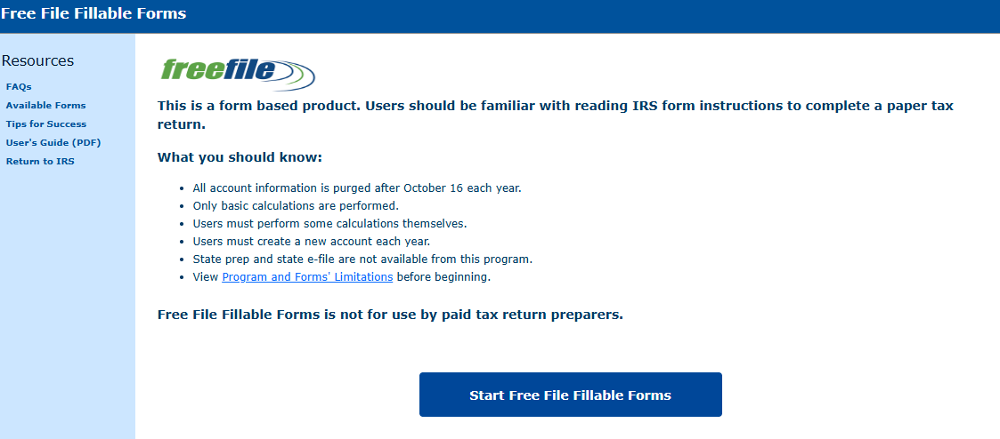

# STYLE.md

Status: present in Module 4, graded for rigor starting Module 5. Tokens above, rationale below.

## Rationale

- **color-text (#172b40):** A dark navy instead of pure black. This is a tool a student uses to log something serious about their own career prospects; a slightly softened dark tone reads as calmer than flat black without losing contrast against the light background.
- **color-background (#f7f9fb):** Near-white rather than pure white. A student re-reading their own evidence entries is doing close reading, not looking at a marketing page, and a slightly warmer white is easier on the eyes for that.
- **color-primary (#123552):** The same dark blue family as the text color, used for the Save button. One accent color instead of a second unrelated one keeps the page from looking like it's trying to sell something, which matters since this is meant to feel closer to a personal record than a product.
- **color-error (#922020):** A clear red, used only for the error text under the evidence form. It needs to be immediately distinguishable from the blue used everywhere else, since AC-3 and AC-4 depend on the student actually noticing the error.
- **color-focus (#b16d00):** An amber focus outline, chosen because it's visible against both the blue buttons and the white background, and it doesn't collide with the error red, so a keyboard user can tell "this is focused" apart from "this is wrong."
- **font-body (Arial, Helvetica, sans-serif):** A plain system sans-serif rather than a downloaded web font. This is a form a student fills out under some stress about their own job prospects; it did not seem worth adding a network dependency (and one more row in TOOLS.md) just to look more designed.
- **space-unit (0.75rem):** Used for button and input padding so touch targets stay comfortably tappable without me hand-tuning every element separately.
- **radius (0.3rem):** A small, consistent rounding on inputs and buttons, just enough to feel less like a raw browser form without looking playful.

## Refusals

Things this interface will never do, and why.

1. **No modal dialogs for anything the student did not ask for.** No "are you sure you want to leave," no upsell popup, nothing that interrupts a student who is already dealing with enough uncertainty about their career. This breaks the pattern a lot of SaaS tools default to (interrupting the user "for their own good"), and it violates the Aesthetic-Usability Effect's cousin problem: an interruption doesn't become acceptable just because it's well-designed.
2. **No autosaving that hides whether a save actually worked.** Every save either clearly succeeds (status message, skill flips to Evidenced) or clearly fails (error message, text preserved). I resent tools that autosave silently and then you find out days later something didn't stick; this violates the Visibility of System Status law on purpose, in the tool's favor, by never letting "probably saved" stand in for "confirmed saved."

## Sources

- Admired: - Admired: Free File Fillable Forms, the IRS's plain-form tax tool. No navigation bar, no imagery beyond a logo, just a short numbered list of what you need to know and one button to start. 

- Resented: - Resented: a job-application portal (Workday-style) with a spinning modal and fake progress bar on every draft save, making a two-second save feel dramatic. No screenshot; described from memory rather than reproducing a real employer's application flow.